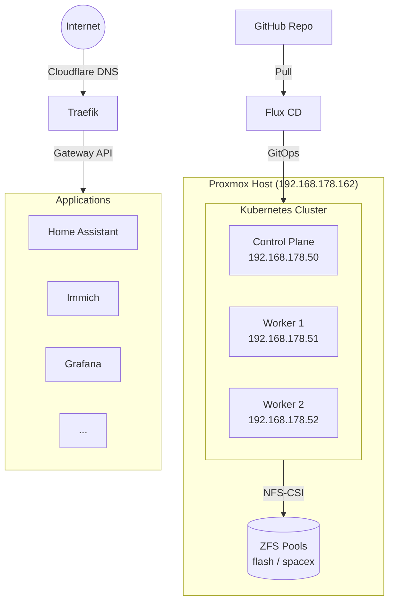
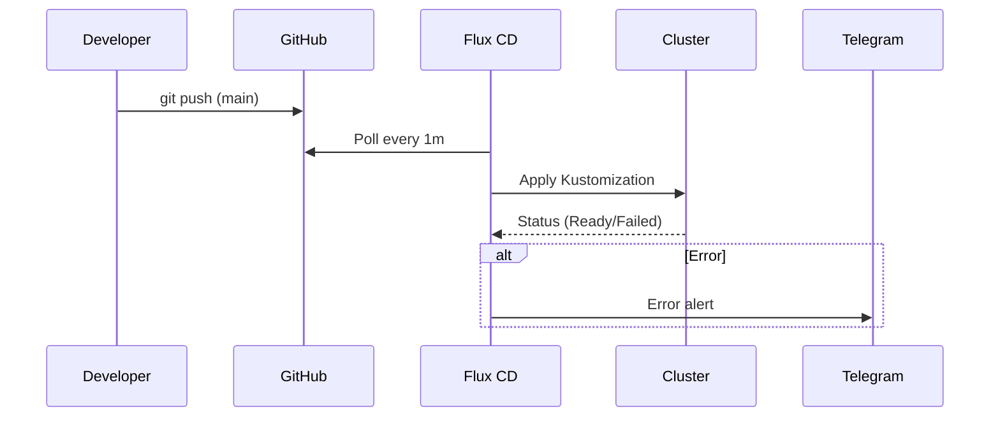

# Architecture

## Overview



## GitOps Flow



## Repository Structure

```
├── clusters/production/     # Flux entry point: defines Kustomizations
│   ├── secrets.yaml         # Kustomization for SOPS secrets
│   ├── infrastructure.yaml  # Kustomization for infrastructure
│   └── apps.yaml            # Kustomization for applications
├── infrastructure/          # Platform components
│   ├── crds/                # Gateway API CRDs
│   ├── metallb/             # L2 load balancer
│   ├── cert-manager/        # TLS wildcard certificates
│   ├── nfs-csi/             # NFS storage driver
│   ├── traefik/             # Ingress controller + Gateway
│   ├── kube-system/         # System patch (metrics-server, etc.)
│   └── notifications/       # Flux → Telegram alert
├── apps/                    # User applications
│   ├── authentik/           # SSO / Identity Provider
│   ├── home-assistant/      # Home automation
│   ├── immich/              # Photo management
│   ├── grafana/             # Metrics dashboard
│   ├── prometheus/          # Monitoring stack
│   ├── gatus/               # Uptime monitoring
│   └── ...                  # Other apps
└── scripts/                 # Diagnostic scripts
```

## Kustomization Dependencies


Flux applies resources in order: `secrets` → `infrastructure` → `apps`. Each level depends on the previous one via `dependsOn`.
