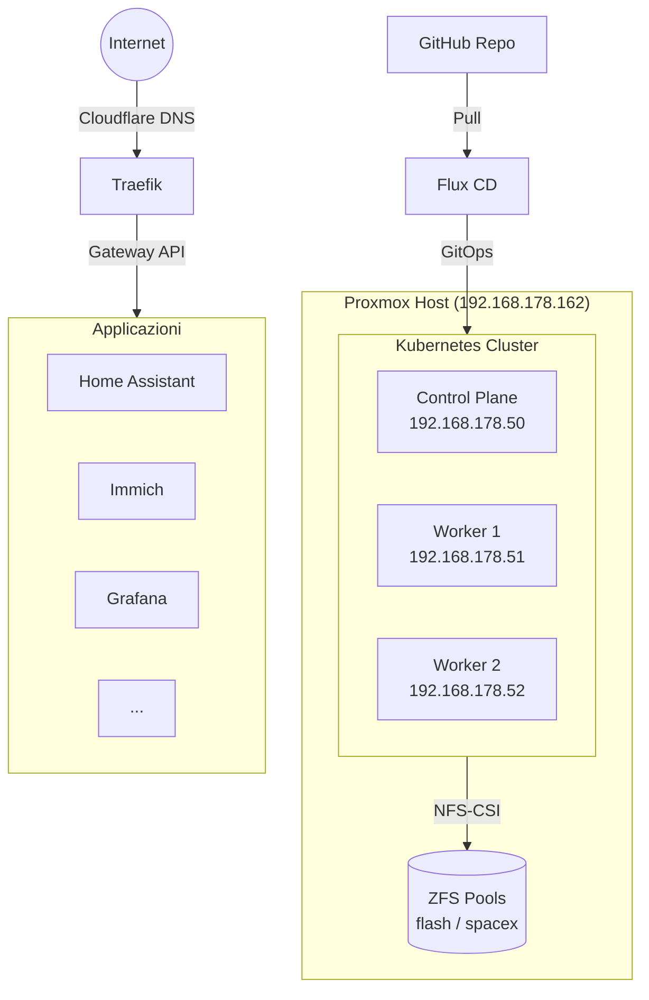
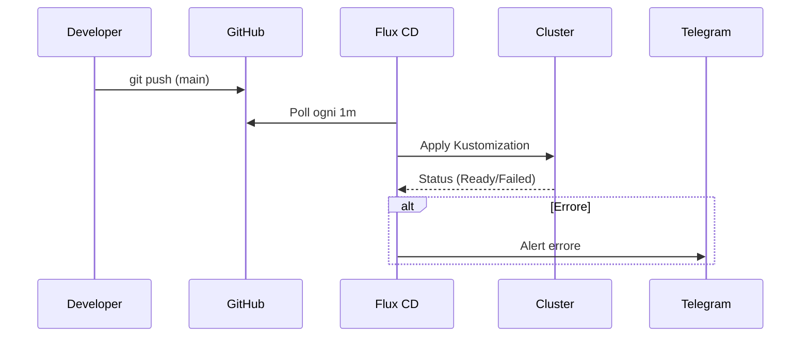

# Architettura

## Panoramica



## Flusso GitOps



## Struttura Repository

```
├── clusters/production/     # Entry point Flux: definisce le Kustomization
│   ├── secrets.yaml         # Kustomization per SOPS secrets
│   ├── infrastructure.yaml  # Kustomization per infrastruttura
│   └── apps.yaml            # Kustomization per applicazioni
├── infrastructure/          # Componenti di piattaforma
│   ├── crds/                # Gateway API CRDs
│   ├── metallb/             # Load balancer L2
│   ├── cert-manager/        # Certificati TLS wildcard
│   ├── nfs-csi/             # Storage driver NFS
│   ├── traefik/             # Ingress controller + Gateway
│   ├── kube-system/         # Patch sistema (metrics-server, ecc.)
│   └── notifications/       # Flux → Telegram alert
├── apps/                    # Applicazioni utente
│   ├── authentik/           # SSO / Identity Provider
│   ├── home-assistant/      # Domotica
│   ├── immich/              # Photo management
│   ├── grafana/             # Dashboard metriche
│   ├── prometheus/          # Monitoring stack
│   ├── gatus/               # Uptime monitoring
│   └── ...                  # Altre app
└── scripts/                 # Script di diagnostica
```

## Dipendenze tra Kustomization


Flux applica le risorse nell'ordine: `secrets` → `infrastructure` → `apps`. Ogni livello dipende dal precedente tramite `dependsOn`.
