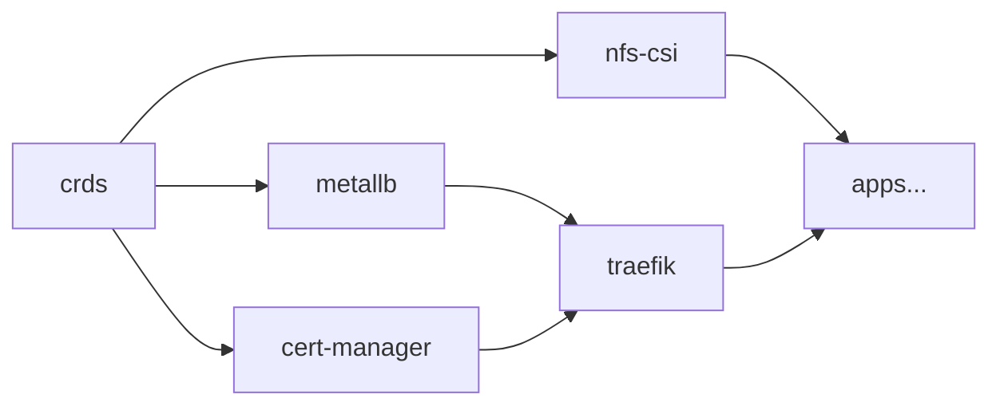

# Infrastructure

Platform components in `infrastructure/`, deployed before applications.

## Components

### MetalLB

Layer 2 load balancer for bare-metal.

- **IP Pool**: `192.168.178.10` – `192.168.178.40`
- **Mode**: L2 Advertisement on interface `eth0`
- **Namespace**: `metallb`

### Traefik

Ingress controller and API Gateway.

- **Chart**: traefik v37.3.0
- **Replicas**: 2 (high availability)
- **Protocol**: Gateway API (native, no legacy Ingress)
- **Ports**: 80 (web) → HTTPS redirect, 443 (websecure) with TLS
- **Global middleware**: automatic HTTP→HTTPS redirect
- **TLS**: wildcard cert via cert-manager

### cert-manager

Automatic TLS certificate management.

- **Issuer**: Let's Encrypt (production)
- **Challenge**: DNS-01 via Cloudflare API
- **Certificate**: wildcard `*.${DOMAIN}`
- **Cloudflare Secret**: encrypted with SOPS

### NFS-CSI Driver

Storage provisioner for persistent volumes.

- **NFS Server**: `192.168.178.162` (Proxmox host)
- **StorageClass**: `nfs-flash` (SSD), `nfs-spacex` (HDD)
- **Reclaim Policy**: Retain (no data deleted automatically)
- **SubDir template**: `${namespace}/${pvc-name}`

### Gateway API CRDs

Custom Resource Definitions for Gateway API (`HTTPRoute`, `Gateway`, `GatewayClass`), managed separately from the Traefik chart to avoid upgrade conflicts.

### kube-system

Patch to the system namespace (e.g. metrics-server).

### Notifications (Flux → Telegram)

Flux CD alerts sent to Telegram when a deploy fails.

- **Provider**: Telegram Bot
- **Severity**: only `error` (no noise from normal events)
- **Monitored sources**: GitRepository, Kustomization, HelmRepository, HelmRelease

## Deploy order

Order is guaranteed by `dependsOn` in the Flux Kustomization.
