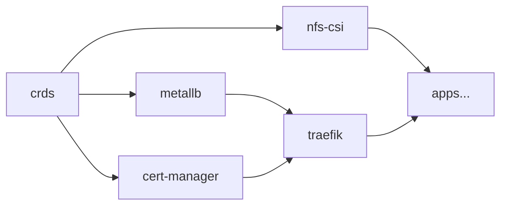

# Infrastruttura

Componenti di piattaforma in `infrastructure/`, deployati prima delle applicazioni.

## Componenti

### MetalLB

Load balancer Layer 2 per bare-metal.

- **Pool IP**: `192.168.178.10` – `192.168.178.40`
- **Modalità**: L2 Advertisement su interfaccia `eth0`
- **Namespace**: `metallb`

### Traefik

Ingress controller e API Gateway.

- **Chart**: traefik v37.3.0
- **Repliche**: 2 (alta disponibilità)
- **Protocollo**: Gateway API (nativo, no Ingress legacy)
- **Porte**: 80 (web) → redirect HTTPS, 443 (websecure) con TLS
- **Middleware globale**: redirect HTTP→HTTPS automatico
- **TLS**: wildcard cert via cert-manager

### cert-manager

Gestione automatica certificati TLS.

- **Issuer**: Let's Encrypt (production)
- **Challenge**: DNS-01 via Cloudflare API
- **Certificato**: wildcard `*.${DOMAIN}`
- **Secret Cloudflare**: cifrato con SOPS

### NFS-CSI Driver

Storage provisioner per volumi persistenti.

- **Server NFS**: `192.168.178.162` (Proxmox host)
- **StorageClass**: `nfs-flash` (SSD), `nfs-spacex` (HDD)
- **Reclaim Policy**: Retain (nessun dato cancellato automaticamente)
- **SubDir template**: `${namespace}/${pvc-name}`

### Gateway API CRDs

Custom Resource Definitions per Gateway API (`HTTPRoute`, `Gateway`, `GatewayClass`), gestite separatamente dal chart Traefik per evitare conflitti di upgrade.

### kube-system

Patch al namespace di sistema (es. metrics-server).

### Notifications (Flux → Telegram)

Alert Flux CD inviati su Telegram quando un deploy fallisce.

- **Provider**: Telegram Bot
- **Severity**: solo `error` (no rumore da eventi normali)
- **Sorgenti monitorate**: GitRepository, Kustomization, HelmRepository, HelmRelease

## Ordine di deploy

L'ordine è garantito dal `dependsOn` nella Kustomization Flux.
