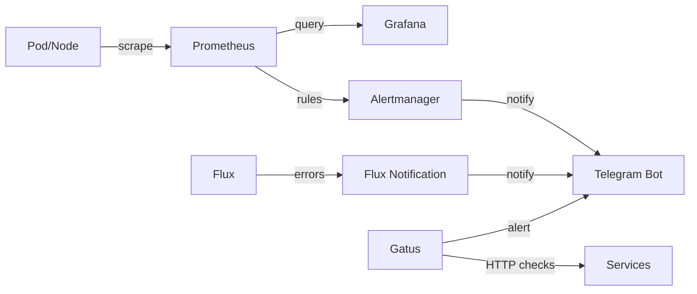

# Monitoring & Alerting

## Monitoring stack



## Prometheus

- **Chart**: kube-prometheus-stack v72.6.2
- **Retention**: 30 days / 18GB max
- **Storage**: nfs-flash (SSD), 20Gi
- **ServiceMonitor**: auto-detects from all namespaces

### Enabled components

| Component | Status | Notes |
|-----------|--------|-------|
| Prometheus | ✅ | Core metrics collection |
| Alertmanager | ✅ | Alert routing → Telegram |
| kube-state-metrics | ✅ | K8s resource metrics |
| node-exporter | ✅ | OS/hardware metrics |
| Grafana | ❌ | Managed separately in `apps/grafana` |

### Disabled components (Talos)

On Talos Linux these components do not expose metrics in the standard way:

- `kubeProxy` → disabled
- `kubeControllerManager` → disabled
- `kubeScheduler` → disabled
- `kubeEtcd` → disabled

## Alertmanager

### Configuration

The full configuration is in a SOPS Secret (`alertmanager-config`) containing:

- Routing rules
- Telegram receiver (bot_token + chat_id)
- Inhibition rules
- Group/repeat intervals

### Active alerts (examples)

| Alert | Severity | Description |
|-------|----------|-------------|
| KubePodCrashLooping | critical | Pod in crash loop |
| KubePodNotReady | warning | Pod not ready > 15m |
| NodeFilesystemSpaceFillingUp | warning | Disk almost full |
| NodeMemoryHighUtilization | warning | RAM > 90% |
| PrometheusTargetDown | critical | Target scrape failed |
| NfsServerUnreachable | critical | All nodes without NFS traffic > 30m |

## Flux Notifications

Alerts separate from Prometheus monitoring, specific for GitOps errors:

- **Trigger**: any Flux resource in `error` state
- **Channel**: same Telegram bot
- **Filters**: ignores routine messages (`waiting.*retrying`, `Health check passed`)

## Gatus

Uptime monitoring with periodic HTTP checks:

- **Dashboard**: `status.${DOMAIN}`
- **Checks**: health endpoint of each service
- **Alert**: Telegram notification if a service is down
- **History**: persisted on nfs-spacex

## Grafana

- **URL**: `grafana.${DOMAIN}`
- **Auth**: OIDC via Authentik
- **Datasource**: Prometheus (auto-configured)
- **Storage**: nfs-flash for persistent dashboards

## Where notifications go

```
📱 Telegram
├── 🔴 Prometheus Alertmanager (cluster/app metrics)
├── 🟠 Flux Notifications (GitOps deploy errors)
└── 🟡 Gatus (HTTP uptime checks)
```

All notifications arrive in the same Telegram chat, with different prefixes to distinguish the source.
