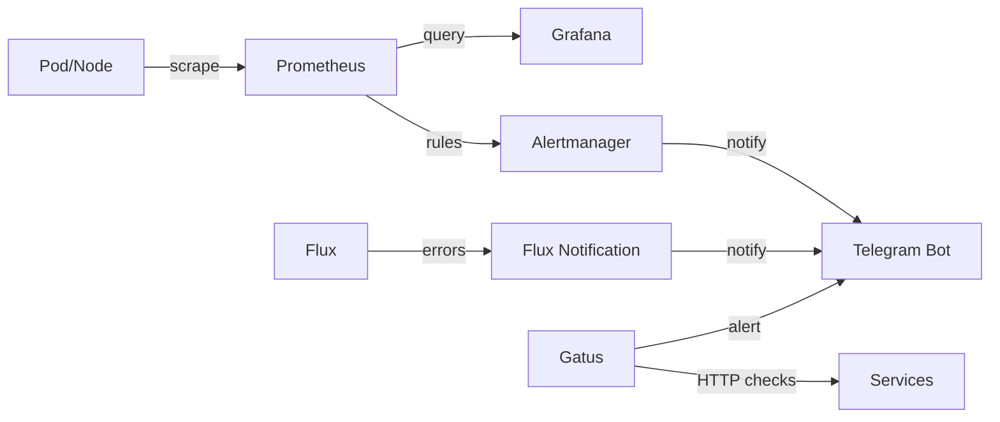

# Monitoraggio & Alert

## Stack di monitoraggio



## Prometheus

- **Chart**: kube-prometheus-stack v72.6.2
- **Retention**: 30 giorni / 18GB max
- **Storage**: nfs-flash (SSD), 20Gi
- **ServiceMonitor**: rileva automaticamente da tutti i namespace

### Componenti abilitati

| Componente | Stato | Note |
|-----------|-------|------|
| Prometheus | ✅ | Core metrics collection |
| Alertmanager | ✅ | Routing alert → Telegram |
| kube-state-metrics | ✅ | Metriche risorse K8s |
| node-exporter | ✅ | Metriche OS/hardware |
| Grafana | ❌ | Gestita separatamente in `apps/grafana` |

### Componenti disabilitati (Talos)

Su Talos Linux questi componenti non espongono metriche nel modo standard:

- `kubeProxy` → disabilitato
- `kubeControllerManager` → disabilitato
- `kubeScheduler` → disabilitato
- `kubeEtcd` → disabilitato

## Alertmanager

### Configurazione

La configurazione completa è in un Secret SOPS (`alertmanager-config`) contenente:

- Routing rules
- Telegram receiver (bot_token + chat_id)
- Inhibition rules
- Group/repeat intervals

### Alert attivi (esempi)

| Alert | Severity | Descrizione |
|-------|----------|-------------|
| KubePodCrashLooping | critical | Pod in crash loop |
| KubePodNotReady | warning | Pod non ready > 15m |
| NodeFilesystemSpaceFillingUp | warning | Disco quasi pieno |
| NodeMemoryHighUtilization | warning | RAM > 90% |
| PrometheusTargetDown | critical | Target scrape fallito |
| NfsServerUnreachable | critical | Tutti i nodi senza traffico NFS > 30m |

## Flux Notifications

Alert separati dal monitoring Prometheus, specifici per errori GitOps:

- **Trigger**: qualsiasi risorsa Flux in stato `error`
- **Canale**: stesso bot Telegram
- **Filtri**: ignora messaggi di routine (`waiting.*retrying`, `Health check passed`)

## Gatus

Uptime monitoring con controlli HTTP periodici:

- **Dashboard**: `status.${DOMAIN}`
- **Checks**: health endpoint di ogni servizio
- **Alert**: notifica Telegram se un servizio è down
- **Storico**: persistito su nfs-spacex

## Grafana

- **URL**: `grafana.${DOMAIN}`
- **Auth**: OIDC via Authentik
- **Datasource**: Prometheus (auto-configurato)
- **Storage**: nfs-flash per dashboard persistenti

## Dove arrivano le notifiche

```
📱 Telegram
├── 🔴 Prometheus Alertmanager (metriche cluster/app)
├── 🟠 Flux Notifications (errori GitOps deploy)
└── 🟡 Gatus (uptime checks HTTP)
```

Tutte le notifiche arrivano sullo stesso chat Telegram, con prefissi diversi per distinguere la sorgente.
