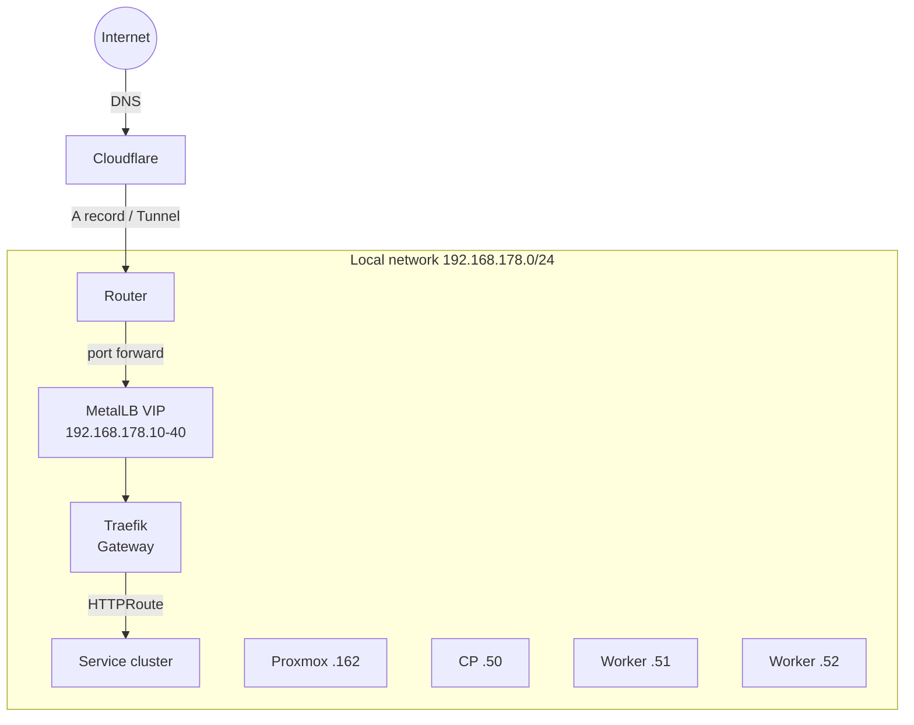

# Networking

## Topology



## MetalLB

- **Mode**: Layer 2
- **Pool**: `192.168.178.10` – `192.168.178.40` (31 IPs available)
- **Interface**: `eth0`

Every `Service type: LoadBalancer` gets an IP from the pool. Traefik is the main consumer.

## Traefik + Gateway API

### Gateway

A single `Gateway` resource (`traefik-gateway`) in the `traefik` namespace with two listeners:

| Listener | Port | Protocol | TLS |
|----------|------|----------|-----|
| `web` | 80 | HTTP | No (redirect → websecure) |
| `websecure` | 443 | HTTPS | Wildcard cert |

### HTTPRoute

Each app declares its own `HTTPRoute` with:

```yaml
spec:
  parentRefs:
    - name: traefik-gateway
      namespace: traefik
      sectionName: websecure
  hostnames:
    - "app.${DOMAIN}"
```

### Middleware

- **Redirect HTTP→HTTPS**: global on `web` entrypoint
- **Forward Auth (Authentik)**: for services without native auth
- **Security headers**: HSTS, X-Frame-Options, etc.

## DNS

- **Provider**: Cloudflare
- **Record**: wildcard `*.${DOMAIN}` → public IP / tunnel
- **cert-manager**: uses Cloudflare API token for DNS-01 challenge

## Exposed ports

| Service | Internal port | Note |
|---------|--------------|------|
| Traefik | 80, 443 | LoadBalancer |
| Mosquitto | 1883 | MQTT (LAN only) |
| Home Assistant | 8123 | hostNetwork (mDNS/discovery) |
