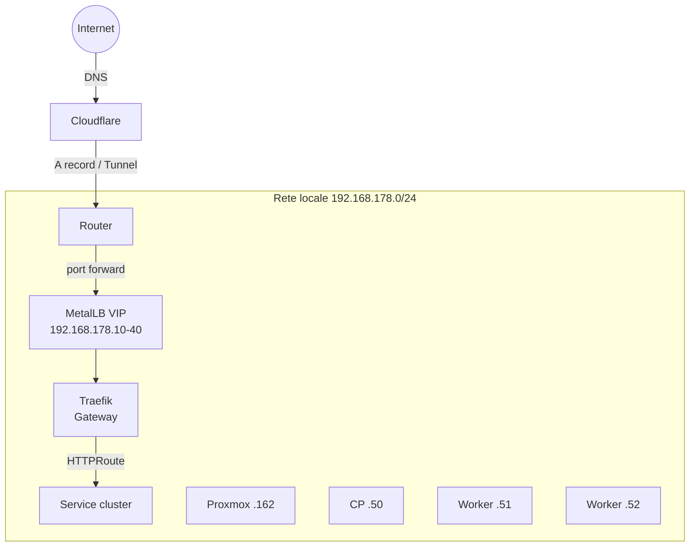

# Networking

## Topologia



## MetalLB

- **Modalità**: Layer 2
- **Pool**: `192.168.178.10` – `192.168.178.40` (31 IP disponibili)
- **Interface**: `eth0`

Ogni `Service type: LoadBalancer` riceve un IP dal pool. Traefik è il consumer principale.

## Traefik + Gateway API

### Gateway

Un singolo `Gateway` resource (`traefik-gateway`) nel namespace `traefik` con due listener:

| Listener | Porta | Protocollo | TLS |
|----------|-------|-----------|-----|
| `web` | 80 | HTTP | No (redirect → websecure) |
| `websecure` | 443 | HTTPS | Wildcard cert |

### HTTPRoute

Ogni app dichiara il proprio `HTTPRoute` con:

```yaml
spec:
  parentRefs:
    - name: traefik-gateway
      namespace: traefik
      sectionName: websecure
  hostnames:
    - "app.${DOMAIN}"
```

### Middleware

- **Redirect HTTP→HTTPS**: globale su entrypoint `web`
- **Forward Auth (Authentik)**: per servizi senza auth nativa
- **Headers sicurezza**: HSTS, X-Frame-Options, ecc.

## DNS

- **Provider**: Cloudflare
- **Record**: wildcard `*.${DOMAIN}` → IP pubblico / tunnel
- **cert-manager**: usa Cloudflare API token per DNS-01 challenge

## Porte esposte

| Servizio | Porta interna | Nota |
|----------|--------------|------|
| Traefik | 80, 443 | LoadBalancer |
| Mosquitto | 1883 | MQTT (solo LAN) |
| Home Assistant | 8123 | hostNetwork (mDNS/discovery) |
