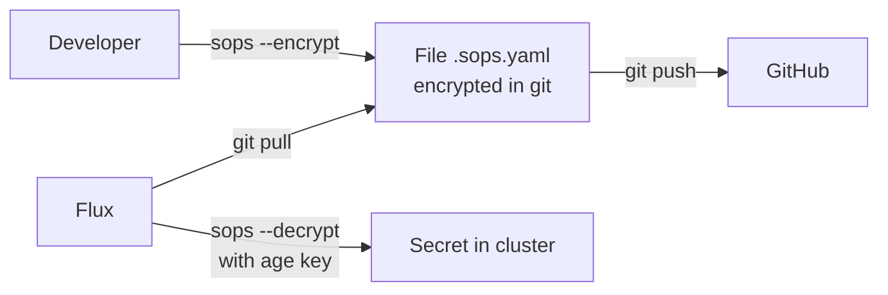

# Security & Secret Management

## Encryption with SOPS + age

All secrets in the repository are encrypted with [SOPS](https://github.com/getsv/sops) using [age](https://age-encryption.org/) as backend.

### How it works



### Configuration (`.sops.yaml`)

```yaml
creation_rules:
  # Infrastructure secrets (data/stringData fields)
  - path_regex: infrastructure/.*
    encrypted_regex: "^(data|stringData)$"
    age: age1tsc9gq8u66ufrv526fsvahg88pd030t42xe4msc4cm2z84dtke2qpwjnwd

  # App secrets
  - path_regex: apps/.*
    encrypted_regex: "^(data|stringData)$"
    age: age1tsc9gq8u66ufrv526fsvahg88pd030t42xe4msc4cm2z84dtke2qpwjnwd
```

### Operations

```bash
# Encrypt a new secret
sops --encrypt --in-place secret-new.sops.yaml

# Decrypt for editing
sops secret-existing.sops.yaml

# Verify encryption
grep "ENC[AES256_GCM" secret-existing.sops.yaml
```

## Sensitive variables (postBuild)

The domain and other global variables are injected by Flux via `postBuild.substituteFrom`:

- `Secret/cluster-vars` → contains `DOMAIN`
- `Secret/telegram-credentials` → contains `TELEGRAM_BOT_TOKEN`, `TELEGRAM_CHAT_ID`

This avoids having the domain in clear text in the repository.

## Authentik (SSO)

Authentik provides centralized authentication for all services:

- **Protocol**: OpenID Connect (OIDC)
- **URL**: `https://auth.${DOMAIN}`
- **Issuer pattern**: `https://auth.${DOMAIN}/application/o/<slug>/`
- **Protection for services without auth**: Traefik forward-auth middleware

## Pod Security

- **Talos default**: Pod Security Standard `baseline` enforced
- **Exception**: namespace `prometheus` has label `privileged` (node-exporter requires host access)

## Best Practices applied

| Practice | Status |
|----------|--------|
| Secrets encrypted in git | ✅ SOPS/age |
| Domain not in clear text | ✅ postBuild substitution |
| Minimal RBAC | ✅ Per-app ServiceAccount |
| TLS everywhere | ✅ Wildcard cert + redirect |
| Centralized SSO | ✅ Authentik OIDC |
| Network policy | ⚠️ Not implemented (trusted cluster) |
| Image scanning | ⚠️ Not implemented |
