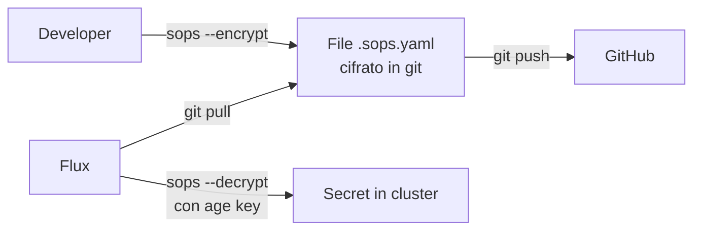

# Sicurezza & Secret Management

## Cifratura con SOPS + age

Tutti i secret nel repository sono cifrati con [SOPS](https://github.com/getsv/sops) usando [age](https://age-encryption.org/) come backend.

### Come funziona



### Configurazione (`.sops.yaml`)

```yaml
creation_rules:
  # Infrastructure secrets (data/stringData fields)
  - path_regex: infrastructure/.*
    encrypted_regex: "^(data|stringData)$"
    age: age1tsc9gq8u66ufrv526fsvahg88pd030t42xe4msc4cm2z84dtke2qpwjnwd

  # App secrets
  - path_regex: apps/.*
    encrypted_regex: "^(data|stringData)$"
    age: age1tsc9gq8u66ufrv526fsvahg88pd030t42xe4msc4cm2z84dtke2qpwjnwd
```

### Operazioni

```bash
# Cifrare un nuovo secret
sops --encrypt --in-place secret-new.sops.yaml

# Decifrare per editing
sops secret-existing.sops.yaml

# Verificare che sia cifrato
grep "ENC\[AES256_GCM" secret-existing.sops.yaml
```

## Variabili sensibili (postBuild)

Il dominio e altre variabili globali sono iniettate da Flux tramite `postBuild.substituteFrom`:

- `Secret/cluster-vars` → contiene `DOMAIN`
- `Secret/telegram-credentials` → contiene `TELEGRAM_BOT_TOKEN`, `TELEGRAM_CHAT_ID`

Questo evita di avere il dominio in chiaro nel repository.

## Authentik (SSO)

Authentik fornisce autenticazione centralizzata per tutti i servizi:

- **Protocollo**: OpenID Connect (OIDC)
- **URL**: `https://auth.${DOMAIN}`
- **Pattern issuer**: `https://auth.${DOMAIN}/application/o/<slug>/`
- **Protezione servizi senza auth**: Traefik forward-auth middleware

## Pod Security

- **Default Talos**: Pod Security Standard `baseline` enforced
- **Eccezione**: namespace `prometheus` ha label `privileged` (node-exporter richiede accesso host)

## Best Practice applicate

| Pratica | Stato |
|---------|-------|
| Secret cifrati in git | ✅ SOPS/age |
| Dominio non in chiaro | ✅ postBuild substitution |
| RBAC minimo | ✅ ServiceAccount per-app |
| TLS everywhere | ✅ Wildcard cert + redirect |
| SSO centralizzato | ✅ Authentik OIDC |
| Network policy | ⚠️ Non implementato (cluster trusted) |
| Image scanning | ⚠️ Non implementato |
