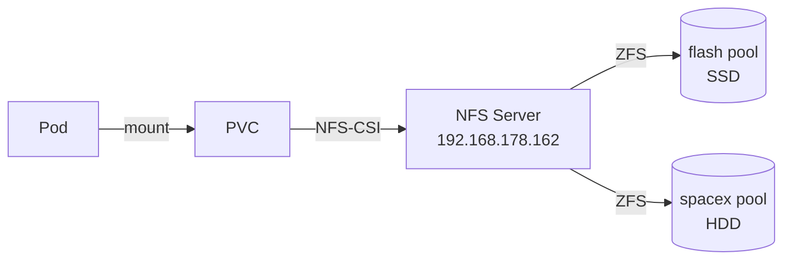

# Storage

## Architecture



## StorageClass

| Name         | ZFS Pool      | Disk Type | Use case                  |
|--------------|--------------|-----------|---------------------------|
| `nfs-flash`  | `/export/flash`   | SSD       | Databases, metrics, fast apps |
| `nfs-spacex` | `/export/spacex`  | HDD       | Media, backup, bulk data      |

### Common configuration

- **Provisioner**: `nfs.csi.k8s.io`
- **Reclaim Policy**: `Retain` — data is never deleted when the PVC is removed
- **Volume Binding**: `WaitForFirstConsumer`
- **Expansion**: enabled (`allowVolumeExpansion: true`)
- **SubDir**: `${namespace}/${pvc-name}` — automatic organization on NFS

## PVC per application

| App         | StorageClass  | Size   | Access Mode | Purpose                |
|-------------|--------------|--------|-------------|------------------------|
| Prometheus  | nfs-flash    | 20Gi   | RWO         | Time-series database   |
| Alertmanager| nfs-flash    | 2Gi    | RWO         | Notification history   |
| Grafana     | nfs-flash    | 1Gi    | RWX         | Persistent dashboards  |
| Immich      | nfs-spacex   | 100Gi+ | RWX         | Photos and videos      |
| Gatus       | nfs-spacex   | 200Mi  | RWX         | Uptime history         |
| Home Assistant Matter | nfs-flash | 1Gi | RWO | Matter bridge state |
| Trek        | nfs-flash    | 1Gi    | RWX         | Travel data            |

## Operational notes

!!! warning "NFS and ReadWriteOnce"
    NFS does not natively enforce RWO locking. If a PVC is marked as `ReadWriteOnce`, the constraint is logical (enforced by Kubernetes, not by the NFS server).

!!! tip "Check available space"
    ```bash
    # From the Proxmox host
    zfs list flash spacex
    ```
