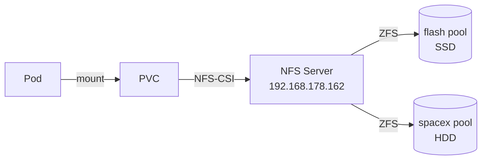

# Storage

## Architettura



## StorageClass

| Nome | Pool ZFS | Tipo disco | Use case |
|------|----------|-----------|----------|
| `nfs-flash` | `/export/flash` | SSD | Database, metriche, app veloci |
| `nfs-spacex` | `/export/spacex` | HDD | Media, backup, dati bulk |

### Configurazione comune

- **Provisioner**: `nfs.csi.k8s.io`
- **Reclaim Policy**: `Retain` — i dati non vengono mai cancellati alla rimozione del PVC
- **Volume Binding**: `WaitForFirstConsumer`
- **Expansion**: abilitata (`allowVolumeExpansion: true`)
- **SubDir**: `${namespace}/${pvc-name}` — organizzazione automatica su NFS

## PVC per applicazione

| App | StorageClass | Size | Access Mode | Scopo |
|-----|-------------|------|-------------|-------|
| Prometheus | nfs-flash | 20Gi | RWO | Time-series database |
| Alertmanager | nfs-flash | 2Gi | RWO | Storico notifiche |
| Grafana | nfs-flash | 1Gi | RWX | Dashboard persistenti |
| Immich | nfs-spacex | 100Gi+ | RWX | Foto e video |
| Gatus | nfs-spacex | 200Mi | RWX | Storico uptime |
| Home Assistant Matter | nfs-flash | 1Gi | RWO | Stato bridge Matter |
| Trek | nfs-flash | 1Gi | RWX | Dati viaggio |

## Note operative

!!! warning "NFS e ReadWriteOnce"
    NFS non supporta nativamente il lock RWO. Se un PVC è marcato `ReadWriteOnce`, il vincolo è solo logico (enforced da Kubernetes, non dal server NFS).

!!! tip "Verifica spazio"
    ```bash
    # Dal Proxmox host
    zfs list flash spacex
    ```
